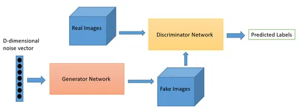
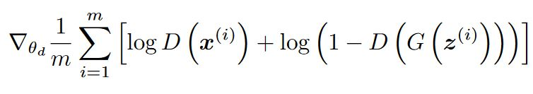

# Generative Adversarial Networks (GANs)

 

GANs work by using two neural networks: a generator and a discriminator. The generator creates data, while the discriminator evaluates how real that data looks. They train in a competitive manner:

#### Generator: 
It takes random noise as input and generates data.

#### Discriminator:
It distinguishes between real and generated data, learning to assign high probabilities to real data.

#### Training: 
The generator minimizes its loss, making its output more convincing. The discriminator maximizes its loss, improving its ability to classify.

 

##### Generating Data: 
Once trained, the generator can create new data samples by inputting random noise.

GANs have been successful in generating various types of data, including images and text. They have applications in image synthesis, style transfer, and more.

## Loss funtion 

 
In Generative Adversarial Networks (GANs), there are two primary loss functions:

#### Generator Loss: 
The generator aims to produce data that looks real. Its loss function is typically binary cross-entropy, encouraging it to minimize the difference between the discriminator's probability for the generated data and 1.

#### Discriminator Loss: 
The discriminator's job is to distinguish real from generated data. It also uses binary cross-entropy, with a goal to maximize the difference between its probability for real data and generated data.

